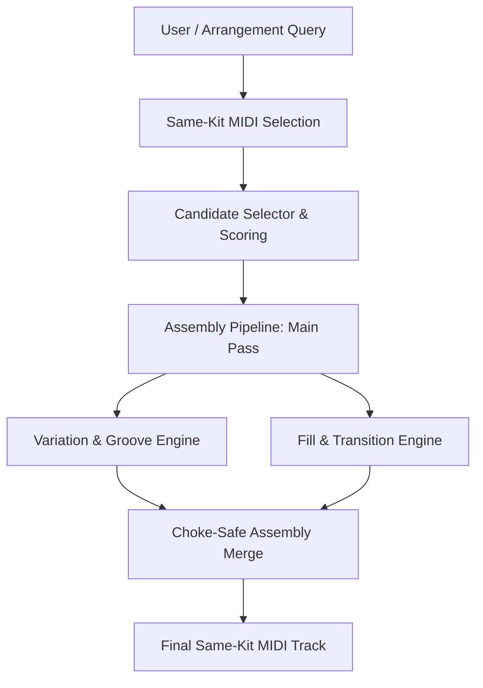

# Sensei Drum: Pattern Assembly Engine Architecture Design

This document details the architectural design for the **Pattern Assembly Engine**, utilizing the metadata layers already available inside the Sensei system. The engine is responsible for making musical decisions (arranging patterns, generating variations, choosing drum fills, and transitioning between sections) based on metadata classifications and compatibility rules.

---

## 1. Core Architecture & Product Boundary

Under the updated product direction, **Sensei Drum preserves kit identity and sound coherence**. 
-   **No Kit Mixing**: Sensei does *not* build new Drum Racks, swap audio samples, or mix pads from unrelated kits.
-   **MIDI-Only Generation**: The selected Ableton kit/rack remains the absolute sound source. Sensei generates, varies, and adapts MIDI patterns *inside* the boundaries of this existing kit.
-   **Cross-Kit Assembly**: Disabled for v1. All variations are generated specifically for the single selected kit's pad layout.



---

## 2. Analysis Resolver & Canonical Metadata Layer

When multiple analyzer modules predict values for the same property, conflicts can occur (e.g. XML bpm vs filename bpm, or pad label vs note number role). The **Analysis Resolver** serves as the Single Source of Truth (SSoT) by evaluating, filtering, and resolving raw candidate analyses into clean **canonical fields**.

### 1. Candidate Analysis Schema
Every analyzer module must publish its raw outputs as a structured `CandidateAnalysis` schema:
```json
{
  "field": "tempo_bpm",
  "value": 92.0,
  "source": "alc_xml",
  "confidence": 1.00,
  "evidence": {"xml_path": "LiveSet/.../Tempo"},
  "version": "1.0.0"
}
```

### 2. Resolver Scoring & Resolution Rules
-   **No Accumulation in Generator**: Raw candidate predictions are *never* directly consumed by the generator or preview builder.
-   **Scoring Strategy**: The Resolver gathers all candidates for a target field, filters out invalid values, sorts by `confidence` descending, and selects the highest scoring candidate as the canonical value.
-   **Single Canonical Value**: There can only be one canonical result per field.

### 3. Canonical vs. Diagnostics Fields
-   **Canonical Metadata**: Consumed directly by the generator. Format:
    -   `tempo_bpm`: `92` (value)
    -   `tempo_source`: `"alc_xml"` (selected source)
    -   `tempo_confidence`: `1.00` (confidence rating)
-   **Diagnostics Metadata**: Holds the raw list of candidate predictions. Retained strictly for UI logging, developer debugging, and analytics, but ignored during production musical decisions.

### 4. Resolution Fields
The resolver handles resolution for all overlapping metadata:
-   `tempo` (alc_xml, ableton_metadata, filename_or_folder, audio_analysis)
-   `pad_role` (pad_label_regex, note_number_defaults, device_chain_signature)
-   `genre` (path_matching, metadata_genres, dataset_matching)
-   `energy` / `complexity` / `kit_write_safety` / `chain_complexity` / `groove_timing` / `compatibility_score`

---

## 3. Same-Kit Variation Strategy

To prevent monotony while maintaining absolute sound coherence, the engine generates real-time variations of the same MIDI pattern:

1.  **Pad-Map Targeting**: Sensei uses `pad_map` exclusively for identifying which notes trigger which drums (e.g. mapping pattern kick notes strictly to the pad identified as `kick`).
2.  **Rhythmic Density & Ghost Notes**:
    -   Vary pattern density dynamically by dropping off-beat hi-hats or ghost-note snares on alternate repetitions.
    -   Velocity values for ghost notes are scaled within the pad's verified velocity zones to ensure natural dynamics.
3.  **Choke-Safe Duration Adjustments**:
    -   When triggering pads belonging to the same choke group (e.g., Open/Closed Hi-hats), note durations are truncated so they never overlap on the timeline.
4.  **Fill Instantiation**:
    -   Snare/Tom rolls or fill patterns are generated strictly using the notes mapped to `snare` or `perc`/`tom` inside the *same* kit. No external kit sounds are introduced.
5.  **Performance Pads Isolation**:
    -   Pads categorized under `performance_pad` (vox chops, synth hits) or `unknown_pad` are preserved to keep the kit's character but are bypassed by the basic drum pattern generator to prevent chaotic triggering.

---

## 4. Protected Rack Handling

Not all Ableton Drum Racks will expose readable device chain details (such as nested Simplers or sampler zones), especially if they are proprietary factory packs or encrypted presets.

-   **Fallback State**: If device chain data is unavailable, protected, or missing:
    -   Set `device_chain_visibility: "protected_or_unavailable"`.
    -   Device chain data is treated as an **optional enhancement**, not a blocking requirement.
-   **Safe MIDI-Only Generation**:
    -   Sensei continues to generate MIDI patterns safely as long as a valid `pad_map` exists.
    -   Rely on the pad label normalizations (`kick`, `snare`, `hat`) and `pad_semantic_group` to target notes.
-   **Choke Safety Override**:
    -   If detailed device chains are unreadable, fall back to parsing choke groups via standard `<ChokeGroup>` tags or GM-standard choke pairs (e.g., Open/Closed Hi-hat notes 42 and 46) to guarantee safe voice cutting.

---

## 5. Clip Relationship Graph

To assemble drum patterns across sections (e.g., Intro -> Verse -> Chorus -> Outro), we construct a **Clip Relationship Graph** where each node represents a MIDI clip in the indexed dataset, and edges represent transition probability based on metadata compatibility.

### Node Attributes
-   `genre` (set of genres)
-   `energy` ("low" | "medium" | "high")
-   `complexity` ("low" | "medium" | "high")
-   `musical_role` (e.g., "drum_core", "percussion")

### Edge Weights (Similarity & Transition Compatibility)
The weight $W_{ij}$ of the edge between Clip $i$ and Clip $j$ determines the likelihood of a musical transition:
$$W_{ij} = \alpha \cdot \text{GenreMatch}(i, j) + \beta \cdot \text{EnergyStep}(i, j) + \gamma \cdot \text{ComplexityStep}(i, j)$$

-   **GenreMatch**: $1.0$ if primary genres match exactly; $0.5$ if sub-genres match; $0.0$ otherwise.
-   **EnergyStep**:
    -   $1.0$ if energy levels are identical.
    -   $0.8$ if energy steps by exactly 1 level.
    -   $0.1$ if energy jumps by 2 levels.

---

## 6. Confidence & Compatibility Scoring

Before any clip is selected, it must be evaluated against the target kit using a **Kit-to-Pattern Compatibility Score** ($S_{ck}$):

$$S_{ck} = \omega_1 \cdot \text{CoreNoteCoverage} + \omega_2 \cdot \text{WriteSafetyMultiplier} - \omega_3 \cdot \text{ChainComplexityPenalty}$$

### 1. CoreNoteCoverage
Ratio of notes used in the MIDI clip that are actively mapped to matching semantic groups in the target kit.
$$\text{CoreNoteCoverage} = \frac{|N_{\text{clip}} \cap N_{\text{kit\_matched}}|}{|N_{\text{clip}}|}$$

### 2. WriteSafetyMultiplier
Kit write safety depends primarily on:
-   A **Kick** pad exists.
-   A **Snare** or **Clap** pad exists.
-   A **Hat** pad exists.
-   Pad semantic groups are resolved to `drum_core`.
-   Unresolved/unknown pads are avoided.
-   Choke groups are respected.

Safety classifications:
-   `safe`: Kick, Snare, and Hat exist and are resolved, low/medium chain complexity. (Multiplier: $1.0$)
-   `caution`: Some unknown pads exist or complexity is high, but core pads are readable. (Multiplier: $0.7$)
-   `unsafe`: Essential core pads (Kick/Snare/Hat) are missing or unreadable. (Multiplier: $0.0$, kit is rejected)

### 3. ChainComplexityPenalty
-   `low` complexity: $0$
-   `medium` complexity: $0.1$
-   `high` complexity or `protected_or_unavailable`: $0.2$ (minor penalty to favor fully transparent kits, but does not block generation)

---

## Proposed Next Patch: "Analysis Candidate Schema v1"

To prepare for metadata resolution, we propose defining a standard `AnalysisCandidate` class in a new utility module `core/analysis_schema.py`:
-   Provides a dataclass wrapper mapping fields, values, sources, and confidences.
-   Includes a standard `resolve(candidates: list[AnalysisCandidate]) -> CanonicalResult` resolver helper.
-   This establishes a standard API contract for all analyzer modules before introducing runtime resolution logic.
