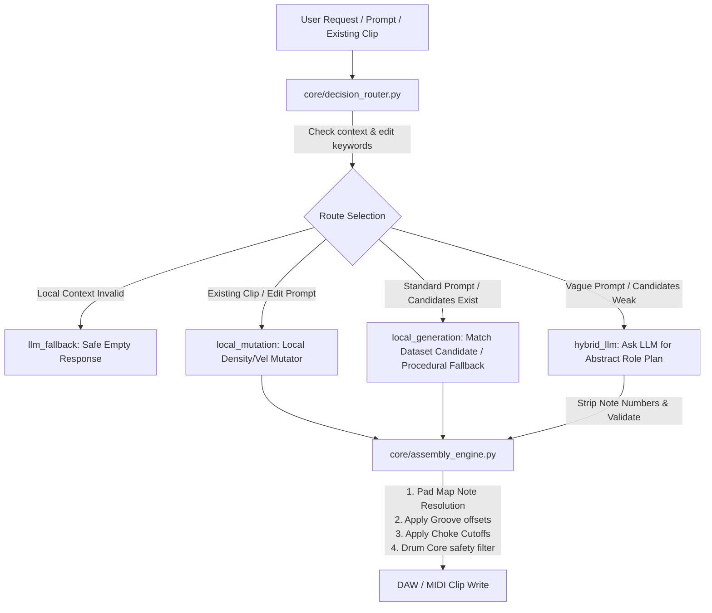

# Sensei Core Architecture Plan

This document outlines the architecture of **Sensei**, transitioning it from a single-voice Drum generator into a modular, multi-instrument **Local-First Musical Decision Platform** designed for advanced AI-assisted music production.

---

## 1. Architectural Philosophy

*   **Local-First, LLM Optional**: Sensei prioritizes local database crawling, procedural patterns, and local mathematical equations (grooves, swing, chokes, safety) as the primary execution path. LLMs are optional creative helpers used only for semantic prompt comprehension or creative fallbacks.
*   **Preserve Identity, Change Behavior**: Sensei does not replace or modify the audio character of a user's DAW instruments (like Ableton Drum Racks). It creates rhythmic and melodic variations purely by manipulating MIDI notes, velocities, durations, and timing offsets.
*   **Single Source of Truth (SSoT)**: Every analysis field (e.g. tempo, pad role) has exactly one canonical value, resolved from competing predictions based on confidence scoring.
*   **Explainable Decisions**: Complete diagnostics logs are emitted for every generation step, detailing routing decisions, LLM usage, pad mappings, groove offsets, and choke applications.

---

## 2. Directory Layout & Boundaries

```
Sensei/
  core/                 # Platform core, SSoT, and shared schemas
    analysis_schema.py  # Standard schemas (AnalysisCandidate, CanonicalResult)
    context_builder.py  # Translates file metadata into generation context
    decision_router.py  # Routes requests (local_generation, local_mutation, hybrid_llm)
    decision_engine.py  # Handles LLM abstract prompt construction & validation
    assembly_engine.py  # Resolves abstract roles, applies grooves, chokes, & safety
    drum_api_client.py  # Orchestrates generation pipelines and handles routing
    generation_memory.py# Local cache tracking user status (accepted/rejected)
  ableton/              # DAW-specific scanner and metadata extraction
    inspector/          # XML inspect loops for .alc (clips) & .adg (presets)
    library_protocol.py # Normalizes scanner output into standard protocol schemas
    library_scanner.py  # Scans filesystems and indexes tags/packs
    ableton_index_provider.py # Direct connection to Ableton SQLite cache
  generators/           # Domain-specific pattern generators
    drum_generator.py   # Rhythmic builder with safety filters & choke groups
  preview/              # Dynamic audio-visual preview generators
    groove_library.py   # Ableton Groove Preset (.agr) parser & humanizer
    preview_builder.py  # Generates browser-ready preview payloads
  tests/                # Full Pytest test suite covering all modules
```

---

## 3. Decision Routing & Assembly Flow



---

## 4. Drum Module Safety & Guard Logic

### Pad Role Classification
Pads inside a Drum Rack are classified into semantic groups to prevent unwanted note generation:
*   `drum_core`: Validated drum voices (Kick, Snare, Closed Hat, Open Hat, Clap, Rim, Perc, Cymbal). Only these are targeted during pattern generation.
*   `performance_pad`: Vocal shots, FX sweeps, or loops (forbidden from core pattern generation).
*   `unknown_pad`: Unlabeled pads (ignored to prevent musical dissonance).

### Choke Group Cutoff
During MIDI note rendering, if two notes belonging to the same choke group (e.g., open hat and closed hat) overlap on the same beat, the duration of the preceding note is dynamically truncated to avoid overlap.

### DAW Scope Guard (Drum Track Guard)
*   MIDI clip creation and note writing are strictly locked to drum-related tracks (defined by name keywords or containing a Drum Rack device).
*   Writes targeting bass, synth, melody, audio, master, or return tracks are intercepted and skipped safely.
*   The script attempts to fallback and write to the first valid drum track in the project. If none is found, it aborts.

---

## 5. Development Roadmap & Status

### Implemented
*   [x] **Decision Routing**: Routes dynamically to `local_generation`, `local_mutation`, `hybrid_llm`, or `llm_fallback` without relying on LLMs for normal operations.
*   [x] **Local Mutation Engine**: Implements local humanization, velocity scaling, and snare fills on existing MIDI events.
*   [x] **Lokal Abstract Assembly**: Converts semantic roles to physical notes, applies chokes, grooves, and safety filters.
*   [x] **Ableton XML Inspector**: Decodes nested Simpler/Sampler rack layouts, macro mappings, and choke parameters.
*   [x] **Groove Preset Parser**: Extracts timing/velocity offsets from `.agr` presets and applies them dynamically to MIDI.
*   [x] **Drum Scope Guard (v1)**: Active Remote Script protection filtering out non-drum tracks.
*   [x] **Complete Test Coverage**: Verified with passing pytest tests.

### In Progress
*   [ ] **Analysis Resolver**: Implementation of generic confidence scoring helpers (`core/analysis_schema.py`) to resolve competing BPM/genre labels.

### Roadmap
*   [ ] **Bass Module**: Scale-aware sliding note filters, energy density controls.
*   [ ] **Chord Module**: Structural chord progression generators.
*   [ ] **Arrangement & Flow Module**: Macro-level structure planning (intro, verse, chorus, outro).
*   [ ] **M4L Bridge**: Realtime MIDI injection via WebSockets directly into active Ableton Live clips.
*   [ ] **MIDI Export**: Physical `.mid` file writer on disk.
